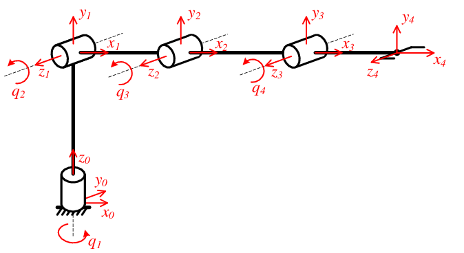
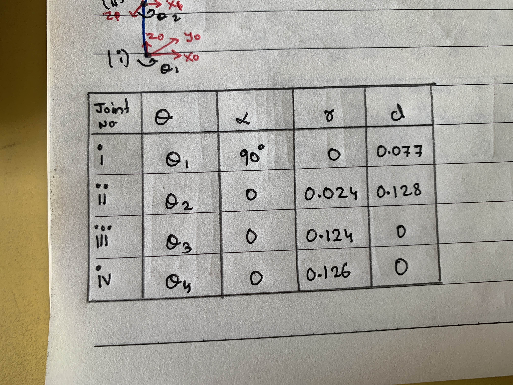
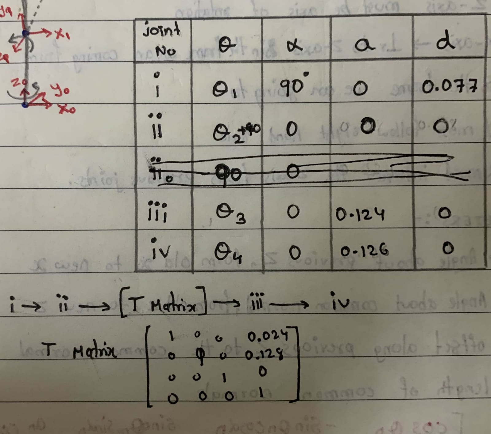
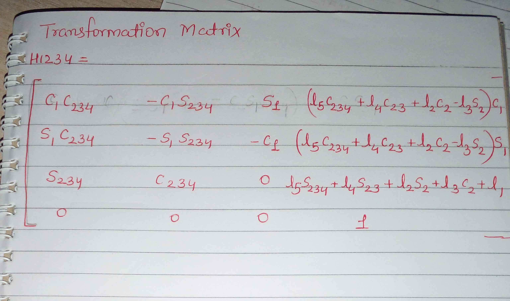
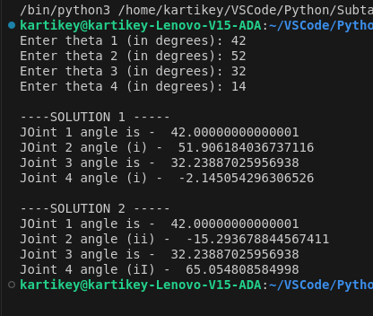

## Mentees  :
- [Yash Suthar](https://github.com/BlazinBull)
- [Kartikey Pathak](https://github.com/NoobMaster-version)
- [Aniket Desai](https://github.com/MASQUERADE-2005)

---
# What have we done so far?
### Courses we completed
Since last 2 Weeks we went through ample amount of resources. Starting with Linear Algebra which is quite important for this project coz in order to build this manipualtor , Understanding of algebra and its meaning Geometrically has played a crucial role till present date. Later we studied and implemented ROS2 (Robot Operating System 2) to deal with the Manipulator in real time. 

### Forward and Inverse Kinematics
After competing this courses and it's implementation, We started with Forward Kinematics. The Manipulator has various joints and links. To Control a Robot we can control it by Either Providing Joint Angles as input so that its End-effector reaches a particular point in it's Workspace or by providing Coordinates of the tip of the End-effector in Cartesian-Coordinate system.

We have successfully completed the Forward Kinematics Part of the 4-DOF manipulator which includes DH parameters,Transformation Matrix and the code for the same.

> 

>The DH parameters are shown below:

---

>The expected and the actual Position were differing so in solution to that problem, We used a Transformation matrix denoted by T Matrix in the below image

> The Final transformation Matrix 

where l1,l2,l3,l4,l5 are link lengths

# What are we dealing with now
As of now we are thinking of the appropriate solution for the *INVERSE KINEMATICS* and going through different resources to solve the same.

Also we have started learning Machine learning(ML) courses simultaneously in order to enable the manipulator to recognize the *Objects* around it and take actions accordingly.

# Difficulties we faced and Future Endeavours
We faced difficulty while finding DH Parameters for forward kinematics since there were various methods availaible across the web. Due to this, It cost us a lot of time.

And currently we are facing issue in getting a trignometric approach to the inverse kinematics as only by using the Coordinates of the End-effector and the link lengths of the manipulator, We have to get joint angles for all 4 joints.

> As of now we are successful in getting the *COORDINATES* when the forward kinematics script is also used along

